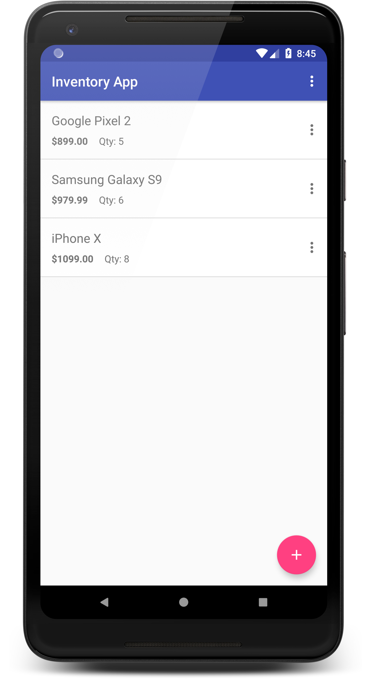
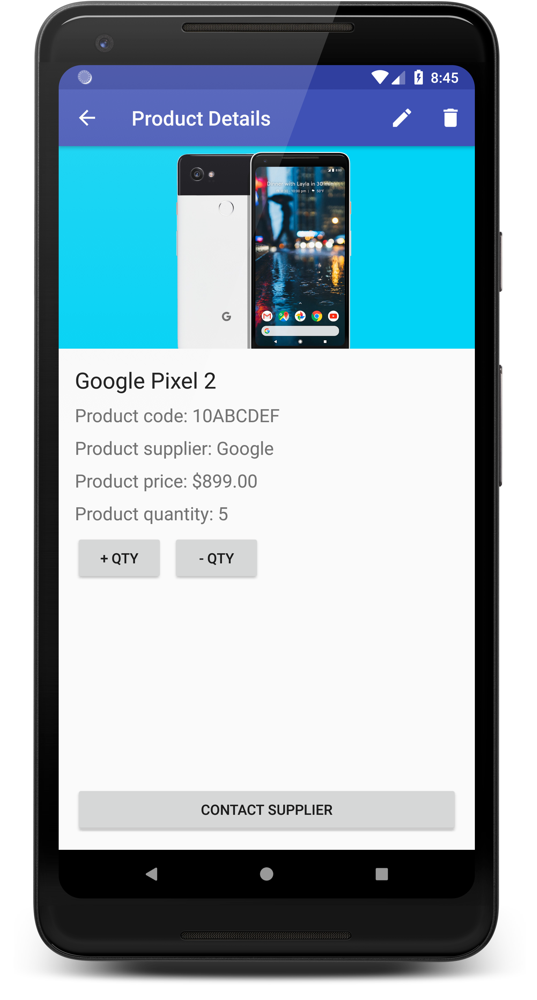

# Inventory App

**Platform: Android (Min SDK: 19, Target SDK: 27)**

**Author: [Timotius Oktorio](https://ca.linkedin.com/in/timotiusoktorio "LinkedIn Profile") (toktorio@gmail.com)**

Simple Android app that can be used by a store to keep track of product inventory and track sales and shipments from the suppliers. This app uses SQLite as the data storage option to store data persistently on the device.

### Features
- Keep track of your product inventory by entering your products information into the app.
- Add a photo of the product by capturing a photo or choose from your device gallery.
- Your product inventory is stored locally on the device so you can use the app offline.

### What I have learned from this project
- Storing and retrieving data using SQLite database.
- Capturing a photo using the device camera and store it in the device storage.
- Retrieving image file from the device gallery and load it into an ImageView.
- Creating implicit intents that contains stored information to other apps.
- Using TextInputLayout from design support library for better input validation.

  

Get the apk file [here](https://github.com/sandeep12407/army-inventory/raw/master/app/release/inventory-app.apk) to install the app on your device. Note that depending on your device settings, you might need to allow installation from unknown sources in order to install this app. Visit this [link](https://www.androidcentral.com/unknown-sources) for the detailed instructions.# army-inventory
